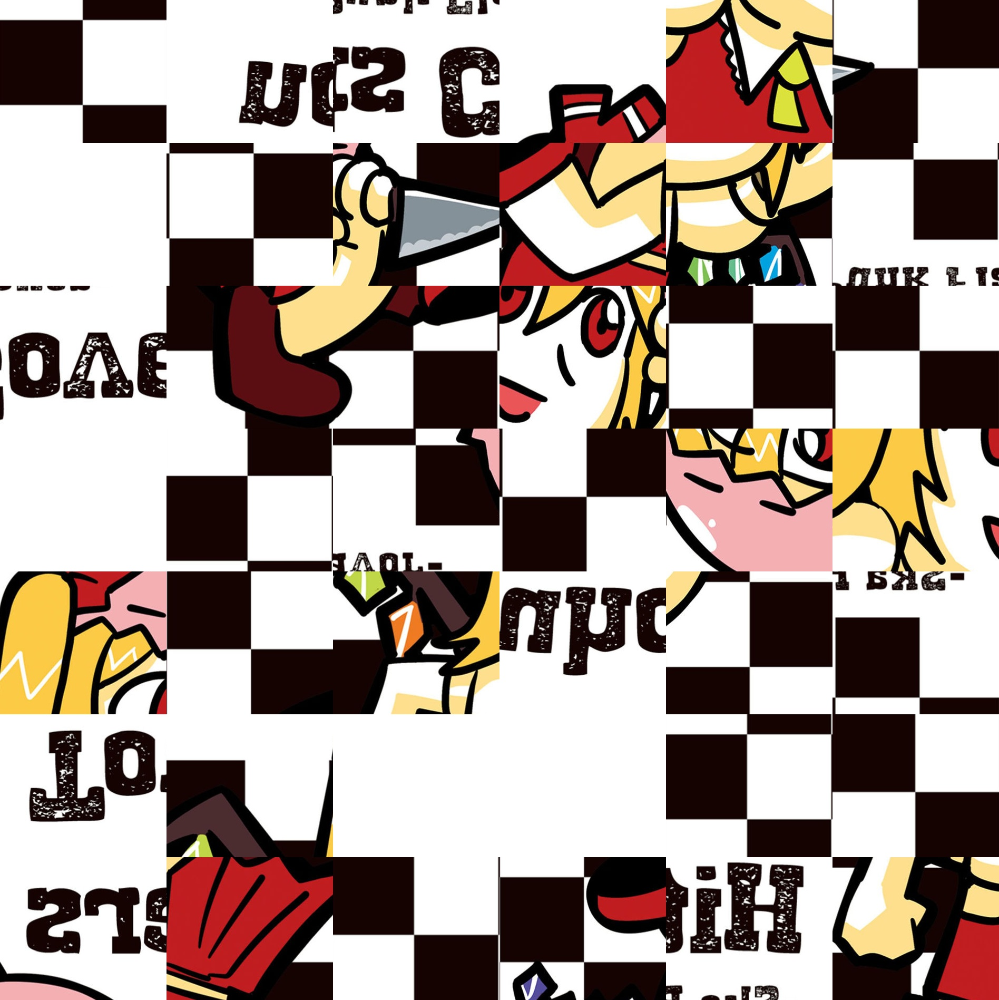

# imgcrypt-67
Don't want your images scraped for an LLM training set? <br>
Don't have a GPU for nightshade or glaze? <br>
Only have a centrino?

This script cuts your art into 6x7 pieces.  <br>
Then takes 6-7 seconds turning ur passphrase 2 a decrypting SHA512 key. <br>

This forces all scrapers to spend 6-7 seconds hashing in order to unshuffle the image.

Grid & Hashtime is configurable via changing the instances of '6x7' & '6700000' to higher values.

Shuffler67 code modified from [@gabrielstork's](https://github.com/gabrielstork) work.

### Added 18/7/2026

I've added a feature that converts your art into a webm & mp4 which has a rapidly glitching layer!
You can adjust the glitch level via changing the ```spatial_step``` variables found in ```shuffler67.py``` lower (less glitch) or higher (more glitches).
Ie:
```
12 > 4
26 > 16
30 > 20
```

Do enter an ideally unique sentence with more than 31 words to generate the randomness!

```
The Prismriver Sisters (Purizumuribaa San-shimai) are three poltergeist named Lunasa Prismriver, Merlin Prismriver and Lyrica Prismriver, together appearing as the stage 4 boss of Perfect Cherry Blossom. Lunasa, Merlin, and Lyrica form the band called the "Prismriver Ensemble". They live at the Ruined Western Mansion and perform at parties and festivals. There was also a fourth Prismriver sister, named Layla Prismriver, who created the others based on her original sisters. 
```

[protected-IOSYS_ska.jpg.webm](https://github.com/user-attachments/assets/5bf7a71b-8f7f-45a5-ae0d-c121b5c77b7d)


# Installation & Startup

Installation:
```
python3 -m venv .venv
source .venv/bin/activate
pip install pycryptodome
pip install numpy
pip install opencv-python
pip install Pillow
pip install imageio
pip install av
deactivate
```

Do not forget to copy the ```image_shuffler67``` folder into the directory where the above python venv exists.

Operation:
```
source .venv/bin/activate
python3 img67hashcrypt.py
deactivate
```

# Try decrypting this image!



- passphrase: flandre

## Credits

* Thanks to [Gabriel Stork's](https://github.com/gabrielstork)'s library [Image_Shuffler](https://github.com/gabrielstork/image-shuffler)

### ZOMG WATCH THIS

[](https://www.youtube.com/watch?v=KxN5V1IzjnU&list=PLbyhCGqsFkvu13i-qlNXXh1ucw8bJHjnx)
